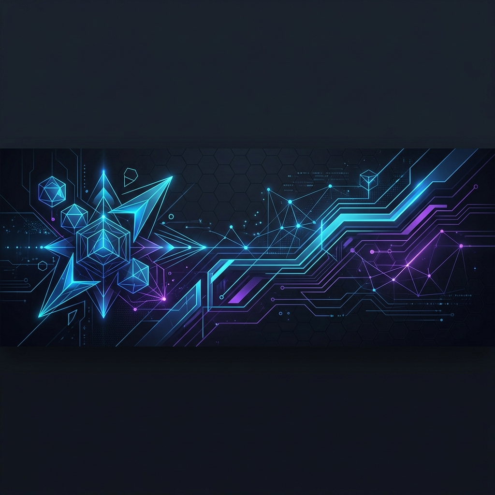

# Hi there 👋 I'm Thao Linh (ThAolInh20)

 

  

### ⚡ Về tôi (About Me)

- 🎓 Tôi là một Lập trình viên đam mê phát triển các ứng dụng web hiệu năng cao và trải nghiệm tương tác 3D.
- 💻 Đang làm việc chủ yếu với các công nghệ: **Laravel**, **Python**, **Three.js** và tự động hóa quy trình với **n8n**.
- 🌱 Tôi đang tiếp tục nghiên cứu sâu hơn về WebGL, kỹ thuật tối ưu hóa Three.js, và các giải pháp triển khai CI/CD với Docker.
- 💬 Hãy hỏi tôi về: Lập trình Web Backend, tích hợp hệ thống, tự động hóa tác vụ hoặc các hoạt cảnh 3D cơ bản.
- ✉️ Liên hệ với tôi qua Email: `aotrame@gmail.com`

---

### 🛠️ Hộp công cụ công nghệ (Tech Stack)

#### 🖥️ Frontend & 3D Interactive

#### ⚙️ Backend & Database

#### 🔧 DevOps, Tools & Automation

---

### 📊 Thống kê GitHub (GitHub Stats)

  
  

  

---

### 🛸 Dự án nổi bật (Featured Projects)

| Tên dự án | Công nghệ | Mô tả ngắn |
| :--- | :--- | :--- |
| [shell-drone-animation](https://github.com/ThAolInh20/shell-drone-animation) | `Three.js` `JS` | Dự án giả lập và trình diễn chuyển động Drone 3D sinh động trên nền Web. |
| [laravel-backend](https://github.com/ThAolInh20) | `Laravel` `Docker` | Hệ thống backend API quản lý nghiệp vụ kinh doanh với cấu trúc rõ ràng. |
| [automation-workflows](https://github.com/ThAolInh20) | `n8n` `Python` | Các script tự động hóa và luồng công việc giúp tối ưu hóa hiệu suất làm việc. |

---

### 🐍 Snake Contribution Map

  <picture>
    <source media="(prefers-color-scheme: dark)" srcset="https://raw.githubusercontent.com/ThAolInh20/ThAolInh20/output/github-contribution-grid-snake-dark.svg">
    <source media="(prefers-color-scheme: light)" srcset="https://raw.githubusercontent.com/ThAolInh20/ThAolInh20/output/github-contribution-grid-snake.svg">
    
  </picture>

